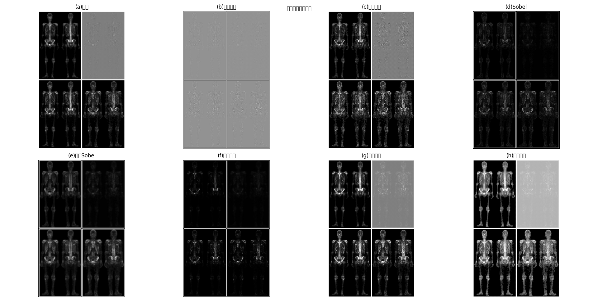
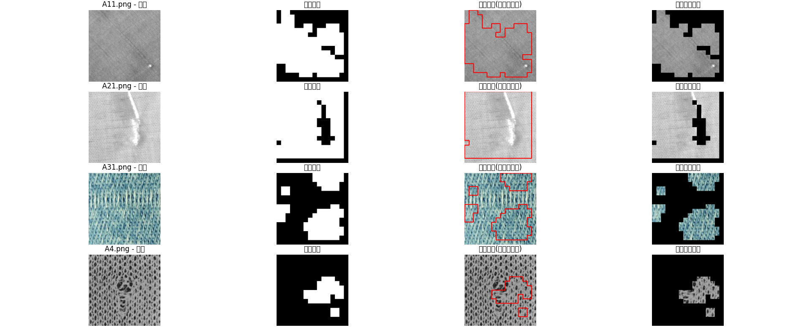
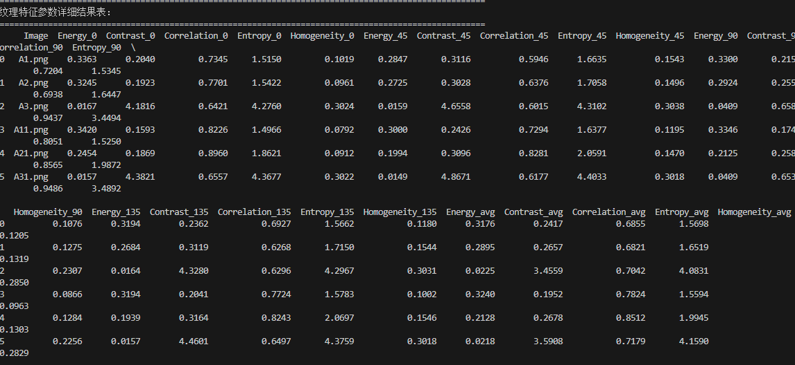
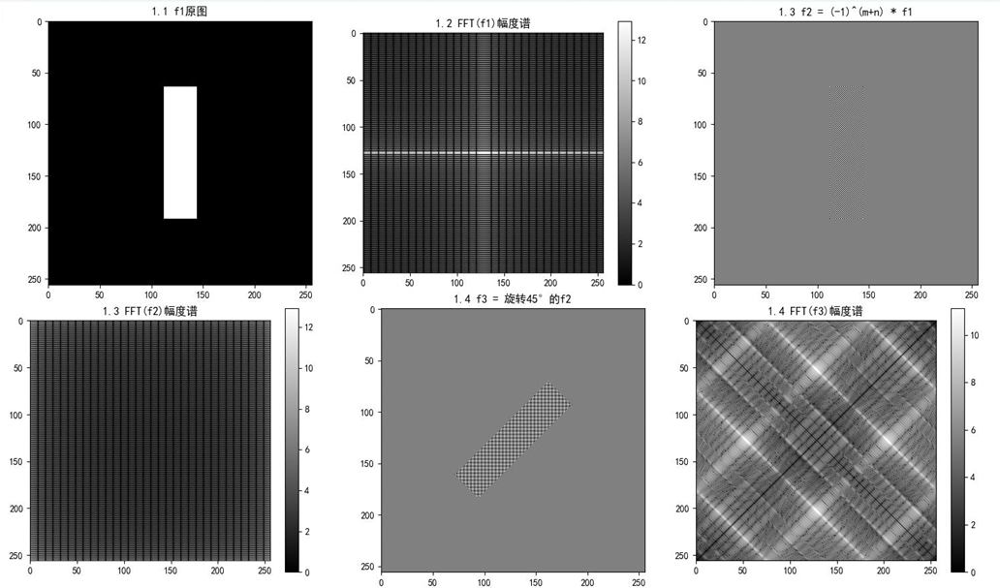
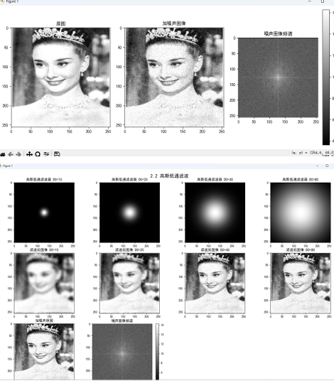
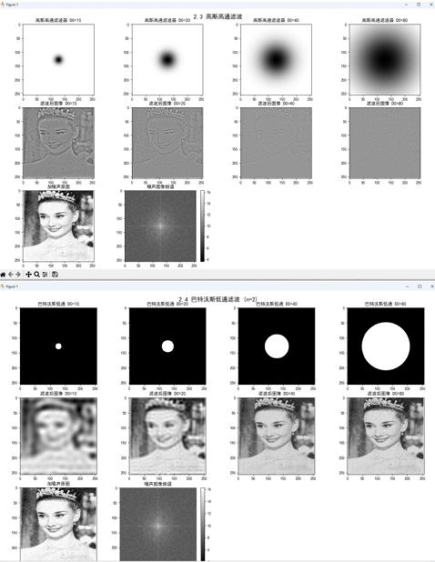
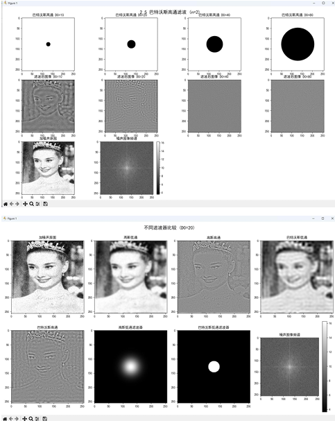

# ImageProcessing · 数字图像处理算法实战

[](https://www.python.org/)
[](https://opencv.org/)
[](LICENSE)

基于 **Python + OpenCV** 的数字图像处理算法合集，覆盖**纹理特征分析、图像增强、频域滤波**三大核心方向。每个模块均包含完整算法实现、可视化结果与量化分析，可直接作为影像算法原型的参考实现。

---

## ✨ 项目亮点

- 🧵 **GLCM 纹理量化分析** — 基于灰度共生矩阵提取能量、对比度、熵等统计特征，将"纹理"这种主观观感转化为可计算的客观指标，并据此完成织物疵点的自动检测与定位
- 🦴 **多算法串联增强管线** — 拉普拉斯锐化 + Sobel 边缘检测 + 伽马校正组合处理骨骼影像，逐步提升对比度与边缘细节，完整展示每步中间结果
- 🌊 **频域滤波对比实验** — FFT 频谱分析 + 高斯 / 巴特沃斯滤波器对比，在噪声抑制与细节保留之间寻找最优平衡
- 📊 **量化评估思维** — 不止"看起来变清晰了"，用特征值表格等客观指标验证处理效果

---

## 📂 模块一览

| 模块 | 源文件 | 核心算法 | 输出 |
| :--- | :--- | :--- | :--- |
| 织物纹理特征分析与疵点检测 | `src/GLCM_texture_defect_detection.py` | 灰度共生矩阵（GLCM）、纹理特征量化 | 疵点检测定位图 + 特征值表 |
| 骨骼图像增强 | `src/bone_image_enhancement.py` | 拉普拉斯锐化、Sobel 边缘检测、幂律变换 | 全流程分步增强对比图 |
| 图像频域处理与滤波 | `src/image_fft_filtering.py` | FFT、高斯滤波、巴特沃斯滤波 | 频谱图与滤波效果对比 |

---

## 🖼️ 效果展示

### 骨骼图像增强全流程



### 织物疵点检测结果



### GLCM 纹理特征量化表



### FFT 频域处理

<p>


</p>
<p>


</p>

---

## 📁 目录结构

```
ImageProcessing/
├── src/                                # 算法源码
│   ├── GLCM_texture_defect_detection.py
│   ├── bone_image_enhancement.py
│   └── image_fft_filtering.py
├── results/                            # 实验结果与可视化图表
│   ├── bone_enhancement_all_steps.png
│   ├── defect_detection_result.png
│   ├── texture_feature_table.png
│   └── fft1~4.png
├── README.md
└── LICENSE
```

---

## 🚀 快速开始

```bash
pip install opencv-python numpy matplotlib

python src/GLCM_texture_defect_detection.py   # 纹理分析与疵点检测
python src/bone_image_enhancement.py          # 骨骼图像增强
python src/image_fft_filtering.py             # 频域滤波实验
```

## 🛠️ 技术栈

Python · OpenCV · NumPy · Matplotlib · ImageJ（质量量化辅助）

## 📜 许可证

本项目基于 [MIT License](LICENSE) 开源。
